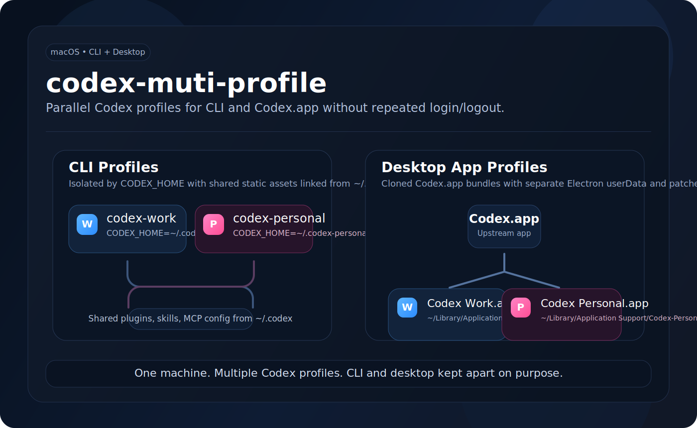

# codex-muti-profile

[](https://www.apple.com/macos/)
[](LICENSE)
[](https://github.com/jackal092927/codex-muti-profile)



Multi-profile launchers for `codex` CLI and `Codex.app` on macOS.

This project makes it practical to keep separate Codex identities such as `personal`, `work`, or `lab` without constantly logging in and out. It supports both:

- `codex` CLI profiles isolated by `CODEX_HOME`
- `Codex.app` clones isolated by both `CODEX_HOME` and Electron `userData`

## Why This Exists

For the CLI, separate `CODEX_HOME` directories are enough to keep auth, config, and state apart.

For the desktop app, that is not enough. `Codex.app` also stores state in Electron-managed app data and normally enforces a single-instance lock. That means a real multi-profile setup needs more than shell wrappers.

`codex-muti-profile` automates the missing pieces:

- per-profile `CODEX_HOME`
- per-profile Electron `userData`
- separate cloned `.app` bundles
- per-clone bundle identifiers
- optional custom app icons
- runtime app labels and Dock badges
- patched multi-instance behavior for desktop clones
- regenerated `ElectronAsarIntegrity` after patching `app.asar`

## What You Get

After installing `personal` and `work`, you can launch:

```bash
codex-personal
codex-work
codex-app-personal
codex-app-work
```

And you get isolated state like:

| Mode | Isolation |
| --- | --- |
| CLI | `~/.codex-personal`, `~/.codex-work` |
| Desktop app | `~/.codex-<profile>` plus `~/Library/Application Support/Codex-<Profile>` |

## Support Matrix

| Capability | CLI | Desktop app |
| --- | --- | --- |
| Separate login state | Yes | Yes |
| Separate config/state directories | Yes | Yes |
| Separate Electron app data | N/A | Yes |
| Parallel instances | Usually yes | Yes, via patched clones |
| Custom icon per profile | N/A | Yes |

## Requirements

- macOS
- `python3`
- `node`
- `codesign`
- optional, for PNG icon conversion:
  - `sips`
  - `iconutil`

The desktop flow is macOS-specific. The CLI flow is simpler and mostly depends on `CODEX_HOME`.

## Quick Start

Install both CLI and desktop profiles:

```bash
./bin/codex-muti-profile install personal
./bin/codex-muti-profile install work
```

This creates:

- `~/.local/bin/codex-account-home`
- `~/.local/bin/codex-personal`
- `~/.local/bin/codex-work`
- `~/.local/bin/codex-app-personal`
- `~/.local/bin/codex-app-work`
- `~/Applications/Codex Personal.app`
- `~/Applications/Codex Work.app`

Then launch:

```bash
codex-personal
codex-work
codex-app-personal
codex-app-work
```

## Install Examples

Install CLI and app together:

```bash
./bin/codex-muti-profile install personal
```

Install CLI only:

```bash
./bin/codex-muti-profile install lab --cli
```

Install desktop app only:

```bash
./bin/codex-muti-profile install lab --app
```

Install a profile with a custom Dock icon:

```bash
./bin/codex-muti-profile install personal \
  --app \
  --force \
  --icon-png ~/Downloads/exports/codex-pp_05_bracketed_1024.png
```

Use a custom app label and bundle id:

```bash
./bin/codex-muti-profile install work \
  --app \
  --label "Codex Work" \
  --bundle-id local.codex.work.app \
  --dock-badge W
```

## How It Works

### CLI

The generated `codex-account-home` helper:

- creates `~/.codex-<profile>`
- symlinks low-churn shared assets from `~/.codex`
- exports `CODEX_HOME`
- launches `codex` in that isolated profile

Shared static items currently include:

- `config.toml`
- `AGENTS.md`
- `plugins`
- `skills`
- `mcp-servers`
- `rules`
- `tools`
- `vendor_imports`

### Desktop app

For each profile, the installer:

1. clones `/Applications/Codex.app` into `~/Applications/Codex <Profile>.app`
2. extracts `Contents/Resources/app.asar`
3. patches Electron bootstrap so the clone can:
   - read `CODEX_ELECTRON_APP_NAME`
   - read `CODEX_ELECTRON_DOCK_BADGE`
   - honor `CODEX_ELECTRON_USER_DATA_PATH`
   - bypass the single-instance lock when `CODEX_ELECTRON_ALLOW_MULTI_INSTANCE=1`
4. repacks `app.asar`
5. recomputes the ASAR header hash used by `ElectronAsarIntegrity`
6. updates `Info.plist`
7. re-signs the cloned app locally with ad-hoc signing

Important: the original `/Applications/Codex.app` is not modified in place. This tool patches only cloned app bundles.

## Output Paths

For a profile named `personal`, the defaults are:

- CLI state: `~/.codex-personal`
- desktop app state: `~/.codex-personal`
- Electron app data: `~/Library/Application Support/Codex-Personal`
- desktop clone: `~/Applications/Codex Personal.app`
- launchers: `~/.local/bin/codex-personal` and `~/.local/bin/codex-app-personal`

## Validation

This workflow was validated end-to-end on a real local Codex installation:

- CLI wrappers correctly isolated `CODEX_HOME`
- cloned desktop apps launched from separate `.app` bundles
- Electron helper processes used separate `--user-data-dir` paths
- per-clone bundle identifiers resolved correctly
- profile-specific app labels and Dock behavior were verified locally

## Limitations

- tested against the current Codex desktop bundle layout in `26.415.x`
- assumes the upstream app still keeps bootstrap logic in `.vite/build/bootstrap.js`
- if OpenAI changes desktop packaging significantly, the patcher may need updates
- cloned apps are re-signed locally, so macOS may require a one-time manual open
- if the Dock keeps an old icon cached, remove the cloned app from the Dock and pin it again once

## Repository Layout

- `bin/codex-muti-profile`
  - main installer
- `lib/extract_asar.mjs`
  - extract an ASAR archive without an npm install step
- `lib/pack_asar.mjs`
  - repack an ASAR archive
- `lib/hash_asar_header.mjs`
  - compute the header hash required by `ElectronAsarIntegrity`
- `lib/asar_vendor`
  - vendored subset of `@electron/asar`

See [NOTICE.md](NOTICE.md) for third-party vendored code details.

## Notes

- This is an independent utility and is not affiliated with OpenAI.
- The project name intentionally follows the repository name `codex-muti-profile`.

## Publish / Fork

If you want to publish your own copy:

```bash
git clone https://github.com/jackal092927/codex-muti-profile.git
cd codex-muti-profile
```
